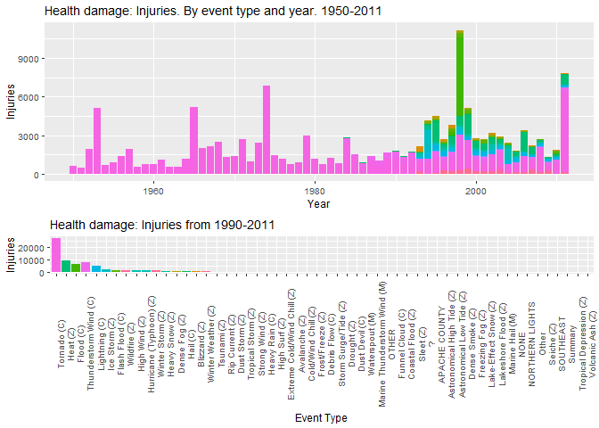
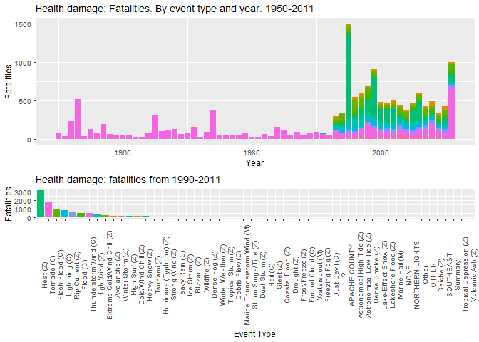
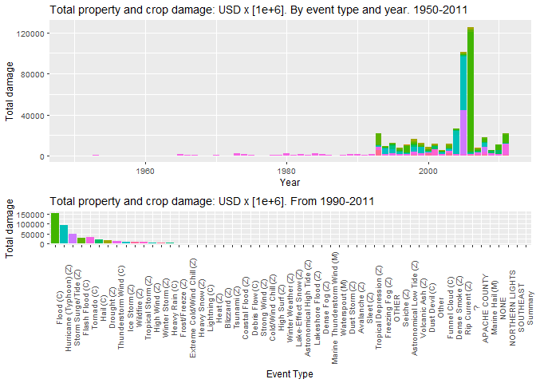

## Data processing

Downloading and reading the data  
- Data available: [Storm Data]("https://d396qusza40orc.cloudfront.net/repdata%2Fdata%2FStormData.csv.bz2")  
"This project involves exploring the U.S. National Oceanic and Atmospheric Administration's (NOAA) storm database. This database tracks characteristics of major storms and weather events in the United States, including when and where they occur, as well as estimates of any fatalities, injuries, and property damage".  


```r
##Downloading and reading the data
if(!file.exists("./data")){dir.create("./data")}
fileUrl <- "https://d396qusza40orc.cloudfront.net/repdata%2Fdata%2FStormData.csv.bz2"
download.file(fileUrl, destfile = "./data/dataset.csv.bz2")  # Windows OS (method="curl" not required)
noaa <- read.csv("./data/dataset.csv.bz2", sep=",", header=TRUE) 
```

Displaying the internal structure of the R object noaa. This with the objective of determining the variables of interest for the exploratory statistical analysis as well as their types. This will allow establishing a strategy for answering the study question: What are the most dangerous / damaging weather event types in the United States?


```r
str(noaa)
```

```
## 'data.frame':	902297 obs. of  37 variables:
##  $ STATE__   : num  1 1 1 1 1 1 1 1 1 1 ...
##  $ BGN_DATE  : chr  "4/18/1950 0:00:00" "4/18/1950 0:00:00" "2/20/1951 0:00:00" "6/8/1951 0:00:00" ...
##  $ BGN_TIME  : chr  "0130" "0145" "1600" "0900" ...
##  $ TIME_ZONE : chr  "CST" "CST" "CST" "CST" ...
##  $ COUNTY    : num  97 3 57 89 43 77 9 123 125 57 ...
##  $ COUNTYNAME: chr  "MOBILE" "BALDWIN" "FAYETTE" "MADISON" ...
##  $ STATE     : chr  "AL" "AL" "AL" "AL" ...
##  $ EVTYPE    : chr  "TORNADO" "TORNADO" "TORNADO" "TORNADO" ...
##  $ BGN_RANGE : num  0 0 0 0 0 0 0 0 0 0 ...
##  $ BGN_AZI   : chr  "" "" "" "" ...
##  $ BGN_LOCATI: chr  "" "" "" "" ...
##  $ END_DATE  : chr  "" "" "" "" ...
##  $ END_TIME  : chr  "" "" "" "" ...
##  $ COUNTY_END: num  0 0 0 0 0 0 0 0 0 0 ...
##  $ COUNTYENDN: logi  NA NA NA NA NA NA ...
##  $ END_RANGE : num  0 0 0 0 0 0 0 0 0 0 ...
##  $ END_AZI   : chr  "" "" "" "" ...
##  $ END_LOCATI: chr  "" "" "" "" ...
##  $ LENGTH    : num  14 2 0.1 0 0 1.5 1.5 0 3.3 2.3 ...
##  $ WIDTH     : num  100 150 123 100 150 177 33 33 100 100 ...
##  $ F         : int  3 2 2 2 2 2 2 1 3 3 ...
##  $ MAG       : num  0 0 0 0 0 0 0 0 0 0 ...
##  $ FATALITIES: num  0 0 0 0 0 0 0 0 1 0 ...
##  $ INJURIES  : num  15 0 2 2 2 6 1 0 14 0 ...
##  $ PROPDMG   : num  25 2.5 25 2.5 2.5 2.5 2.5 2.5 25 25 ...
##  $ PROPDMGEXP: chr  "K" "K" "K" "K" ...
##  $ CROPDMG   : num  0 0 0 0 0 0 0 0 0 0 ...
##  $ CROPDMGEXP: chr  "" "" "" "" ...
##  $ WFO       : chr  "" "" "" "" ...
##  $ STATEOFFIC: chr  "" "" "" "" ...
##  $ ZONENAMES : chr  "" "" "" "" ...
##  $ LATITUDE  : num  3040 3042 3340 3458 3412 ...
##  $ LONGITUDE : num  8812 8755 8742 8626 8642 ...
##  $ LATITUDE_E: num  3051 0 0 0 0 ...
##  $ LONGITUDE_: num  8806 0 0 0 0 ...
##  $ REMARKS   : chr  "" "" "" "" ...
##  $ REFNUM    : num  1 2 3 4 5 6 7 8 9 10 ...
```

The variables selected to form the new data frame are: 
BGN_DATE : chr, END_DATE  : chr, EVTYPE    : chr, FATALITIES: num, INJURIES  : num, PROPDMG   : num, PROPDMGEXP: chr, CROPDMG   : num, CROPDMGEXP: chr, REFNUM    : num.  

```r
library(dplyr)
```

```
## 
## Attaching package: 'dplyr'
```

```
## The following objects are masked from 'package:stats':
## 
##     filter, lag
```

```
## The following objects are masked from 'package:base':
## 
##     intersect, setdiff, setequal, union
```

```r
library(lubridate)
```

```
## Warning: package 'lubridate' was built under R version 4.0.5
```

```
## 
## Attaching package: 'lubridate'
```

```
## The following objects are masked from 'package:base':
## 
##     date, intersect, setdiff, union
```

```r
# The variables selected
noaa <- select(noaa, BGN_DATE, END_DATE, EVTYPE, FATALITIES, INJURIES, PROPDMG, PROPDMGEXP, CROPDMG, CROPDMGEXP, REFNUM)
# Editing text variables. Lowercase. 
names(noaa) <- tolower(names(noaa))
```

**Requiered transformations are justified below:**  

1. bgn_date (begining date of event) and end_date (ending date of event). These variables are modified in order to normalize the variable. From Chr to Date type.  


```r
# formatting BGN_DATE and END_DATE. Eliminating the time 0:00:00 from in each string.From Chr to Date type.
noaa$bgn_date <- mdy(gsub(" .*$", "", noaa$bgn_date))
noaa$end_date <- mdy(gsub(" .*$", "", noaa$end_date))
```

2. evtype (event type), shows 985 levels, however, 48 event types are reported in the document: [NATIONAL WEATHER SERVICE INSTRUCTION 10-1605 APPENDIX A](https://d396qusza40orc.cloudfront.net/repdata%2Fpeer2_doc%2Fpd01016005curr.pdf). This section provides guidelines for entering event types in the Storm Data software.  

**Many of the events recorded in the database are a combination of different event types or simply do not have a description associated with any of the event types. Nevertheless, one condition of the assignment says: "as indicated in the EVTYPE variable", therefore, modifications will be made to it. Column evtype must be standardized.**  

*Number of event types in the variable evtype (raw data)

```r
#Number of event types in the variable evtype
summary(levels(as.factor(noaa$evtype)))
```

```
##    Length     Class      Mode 
##       985 character character
```


```r
#Astronomical Low Tide Z
  noaa$evtype[grepl("^(ASTRONOMICAL LOW)", noaa$evtype, ignore.case = TRUE)] <- "Astronomical Low Tide (Z)"

#Astronomical High Tide Z
noaa$evtype[grepl("^(ASTRONOMICAL HIGH|HIGH TIDES|HIGH WIND AND HIGH TIDES)", noaa$evtype, ignore.case = TRUE)] <- "Astronomical High Tide (Z)"

#Storm Surge/Tide Z
noaa$evtype[grepl("^(STORM SURGE/TIDE|BLOW-OUT TIDE|STORM SURGE)", noaa$evtype, ignore.case = TRUE)] <- "Storm Surge/Tide (Z)"

#Avalanche Z
noaa$evtype[grepl("^(AVALANCE|AVALANCHE|HEAVY SNOW/BLIZZARD/AVALANCHE)", noaa$evtype, ignore.case = TRUE)] <- "Avalanche (Z)"

#Blizzard Z
noaa$evtype[grepl("^(BLIZZARD$|BLIZZARD WEATHER|HIGH WIND.*BLIZZARD|BLIZZARD/HIGH WIND|GROUND BLIZZARD)", noaa$evtype, ignore.case = TRUE)] <- "Blizzard (Z)"

#Winter Storm Z
noaa$evtype[grepl("^(WINTER STORM$|WINTER STORMS$|BLIZZARD AND EXTREME WIND CHIL|BLIZZARD AND HEAVY SNOW|HEAVY SNOW/BLIZZARD)|WINTER STORM", noaa$evtype, ignore.case = TRUE)] <- "Winter Storm (Z)"

#Winter Weather Z
noaa$evtype[grepl("^(WINTER MIX|Wintry mix$|WINTER WEATHER/MIX|WINTERY MIX|WINTER WEATHER|Freezing rain|Freezing drizzle|Freezing rain|FREEZING PRECIP|SNOW.*FREEZING RAIN|NON-SEVERE WIND DAMAGE|No Severe Weather|BLIZZARD/FREEZING RAIN|LIGHT FREEZING RAIN|LACK OF SNOW)", noaa$evtype, ignore.case = TRUE)] <- "Winter Weather (Z)"

#Heavy Snow Z
noaa$evtype[grepl("^(HEAVY SNOW$|HEAVY SNOW.*|blowing snow|COLD AND SNOW|Drifting Snow|EARLY SNOW|EXCESSIVE SNOW|FALLING SNOW|HEAVY SNOW|HIGH WINDS/SNOW|Late-season Snowfall|LATE SEASON SNOW|LATE SNOW|MODERATE SNOWFALL|Monthly Snowfall|Mountain Snows|NEAR RECORD SNOW|PROLONG COLD/SNOW|record.*snow|snow.*record|Snow Accumulation|SNOW AND WIND|SNOW SQUALL|SNOW/BLOWING SNOW|SNOW.*COLD$|SNOW/RAIN$|SNOW/HEAVY SNOW|SNOW/HEAVY SNOW|SNOW$|SNOW ADVISORY|SNOW AND COLD|BLIZZARD/HEAVY SNOW|HEAVY WET SNOW|SNOW AND HEAVY SNOW|MODERATE SNOW|Seasonal Snowfall|ACCUMULATED SNOWFALL|FIRST SNOW)", noaa$evtype, ignore.case = TRUE)] <- "Heavy Snow (Z)"

#Ice Storm Z
noaa$evtype[grepl("^(ICE AND SNOW|ICE STORM|SNOWSTORM|THUNDERSNOW|SNOW/ICE STORM|Icestorm/BlizzardIce/Snow|ICE$|ICE FLOES|GLAZE/ICE STORM|GLAZE|SNOW/ICE|ICE/SNOW|Icestorm/Blizzard)", noaa$evtype, ignore.case = TRUE)] <- "Ice Storm (Z)"

#Flood C
noaa$evtype[grepl("^(FLOOD?|FLOODING$|URBAN/STREET FLOO|Flood/Strong|URBAN/SMALL STREAM FLOOD|URBAN/SMALL STREAM  FLOO|URBAN FLOOD|URBAN AND SMALL STREAM FLO|TIDAL FLOO|THUNDERSTORM WINDS/FLOOD|THUNDERSTORM WINDS/ FLOOD|THUNDERSTORM WINDS URBAN FLOOD|STREET FLOOD|STREAM FLOOD|SNOWMELT FLOOD)|URBAN FLOOD|STREAM FLOOD|RURAL FLOOD|MAJOR FLOOD|LOCAL FLOOD|SEVERE TURBULENCE|JAM FLOODING|HIGHWAY FLOOD|WINDS/FLOODING|& FLOOD)", noaa$evtype, ignore.case = TRUE)] <- "Flood (C)"

#Coastal Flood Z
noaa$evtype[grepl("^(COASTAL F|BEACH EROS|BEACH FLO|COASTAL EROS|COAS.*STORM|COAS.*SURGE|COASTAL.*FLOOD)| COASTAL FLOOD|COASTALFLOOD|COASTAL/TI/|CSTL F", noaa$evtype, ignore.case = TRUE)] <- "Coastal Flood (Z)"

#Flash Flood C
noaa$evtype[grepl("^(flash f|THUNDERSTORM WINDS/FLASH|URBAN.*SM.*STR|URBAN.*SM.*STR.*FL|URBAN SMALL$|URBAN AND SMALL|URBAN/SMALL|URBAN/SMALL FLOODING|BREAKUP FLOODING|ICE JAM|MINOR FLOOD|RAPIDLY RISING WATER|RIVER FLOOD|SM.* STREA.*|DAM FAILURE|DAM BREAK)|flashflood|flash flood", noaa$evtype, ignore.case = TRUE)] <- "Flash Flood (C)"

#Lakeshore Flood Z
noaa$evtype[grepl("^(lake flood)|lake.*flood", noaa$evtype, ignore.case = TRUE)] <- "Lakeshore Flood (Z)"

#Lake-Effect Snow Z
noaa$evtype[grepl("^(gusty lake)|lake.*snow", noaa$evtype, ignore.case = TRUE)] <- "Lake-Effect Snow (Z)"

#Extreme Cold/Wind Chill Z
noaa$evtype[grepl("^(extreme wind|extreme cold)", noaa$evtype, ignore.case = TRUE)] <- "Extreme Cold/Wind Chill (Z)"

#Cold/Wind Chill Z
noaa$evtype[grepl("^(BITTER WIND|COLD WIND CHILL|COLD/WIND CHILL|HIGH WIND/LOW WIND CHI|HIGH WIND/WIND CHILL|HIGH WINDS AND WIND CH|LOW WIND CHILL|SNOW- HIGH WIND- WIND CH|WIND CHILL|UNSEASONAL LOW TEMP|UNUSUALLY COLD|UNUSUALLY LATE SNOW$|UNSEASONABLY CO|SNOW\\COLD|SNOW/COLD|SEVERE COLD|RECORD COO|RECORD COL|PROLONG COLD|LOW TEMPERATURE RECORD|COOL AND WET|COLD WAVE$|COLD WEATHER|Cold Temperature$|Cold$|Excessive Cold|Extended Cold|EXTREME/RECORD COLD|LOW TEMPERATURE|RECORD  COLD|RECORD LOW|COLD AND WET CONDITIONS|COLD TEMPERATURES|HYPOTHERMIA|HYPERTHERMIA|Unseasonable Cold|COOL SPELL)|SPELLS", noaa$evtype, ignore.case = TRUE)] <- "Cold/Wind Chill (Z)"

#Debris Flow C. 
noaa$evtype[grepl("^(MUDSLIDE|MUDS LIDE|MUD.*SLIDE|ROCK SLIDE|LANDSLUMP|Landslump|LANDSLIDE)", noaa$evtype, ignore.case = TRUE)] <- "Debris Flow (C)"

#Dense Fog Z
noaa$evtype[grepl("^(fog|dense fog)|patchy dense fog", noaa$evtype, ignore.case = TRUE)] <- "Dense Fog (Z)"

#Freezing Fog Z
noaa$evtype[grepl("^(freezing fog|ice fog)|freezing fog|Freezing Spray", noaa$evtype, ignore.case = TRUE)] <- "Freezing Fog (Z)"

#Dense Smoke Z
noaa$evtype[grepl("^(dense smoke|smoke)", noaa$evtype, ignore.case = TRUE)] <- "Dense Smoke (Z)"

#Drought Z
noaa$evtype[grepl("^(drought|RECORD DRY.*|ABNORMA.*DRY|DRY$|UNSEASONABLY DRY$|DRY MICRO.*|DRY WEA.*|DRYNESS$|DRY|DRIEST MONTH|EXCESSIVELY DRY|Hot and Dry$|MILD.*PATTERN|VERY DRY|WARM DRY CONDITIONS)|drought", noaa$evtype, ignore.case = TRUE)] <- "Drought (Z)"

#Excessive Heat Z
noaa$evtype[grepl("^(RECORD/EXCESSIVE HEAT|EXCESSIVE HEAT)", noaa$evtype, ignore.case = TRUE)] <- "Excessive Heat (Z)"

#Heat Z
noaa$evtype[grepl("^(RECORD/EXCESSIVE HEAT|EXCESSIVE HEAT|EXTREME HEAT|HEAT|HEAT WAVE|Heatburst|RECORD HEAT|RECORD/EXCESSIVE HEAT|UNSEASONABLY WARM.*|UNUSUAL.*WAR.*|VERY WARM$|RECORD.*HIGH.*|RECORD TEMP.*|RECORD.*WAR|ABNORM.*WARM|WARM WEATHER|UNSEASONABLY HOT|Temperature record$|HOT PATTERN|HOT/DRY PATTERN|HOT SPELL|HIGH TEMPERATURE RECORD|HOT WEATHER$|PROLONG WARMTH|MONTHLY TEMPERATURE)", noaa$evtype, ignore.case = TRUE)] <- "Heat (Z)"

#Dust Devil C
noaa$evtype[grepl("^(DUST DEVEL|BLOWING DUST|Dust Devil)", noaa$evtype, ignore.case = TRUE)] <- "Dust Devil (C)"

#Dust Storm Z
noaa$evtype[grepl("^(DUST STORM|DUSTSTORM|saharan dust)", noaa$evtype, ignore.case = TRUE)] <- "Dust Storm (Z)"

#Frost/Freeze Z
noaa$evtype[grepl("^(frost|frost|FREEZE$|PATCHY ICE|ICY ROADS|Icy Roads|ICE.*ROAD$|AGRICULTURAL FREEZE|DAMAGING FREEZE|EARLY FREEZE|Early Frost|FIRST FROST|HARD FREEZE|LATE FREEZE|COLD AND FROST|ICE ON ROAD|ICE ROADS|BLACK ICE)", noaa$evtype, ignore.case = TRUE)] <- "Frost/Freeze (Z)"

#Sleet Z
noaa$evtype[grepl("^(Light snow|RAIN/SNOW|SLEET/RAIN/SNOW|sleet|SLEET/SNOW|SNOW AND ICE|SNOW SHOWERS|SNOW/ ICE|WET SNOW|ICE PELLETS)|sleet", noaa$evtype, ignore.case = TRUE)] <- "Sleet (Z)"

#Funnel Cloud C
noaa$evtype[grepl("^(funnel|MARINE MISHAP|Marine Accident|WALL CLOUD|ROTATING WALL CLOUD|LARGE WALL CLOUD)|funnel", noaa$evtype, ignore.case = TRUE)] <- "Funnel Cloud (C)"

#Hail C
noaa$evtype[grepl("^(hail|DEEP HAIL|HAILSTORMS|NON SEVERE HAIL|LATE SEASON HAIL$|WIND/HAIL|small hail)", noaa$evtype, ignore.case = TRUE)] <- "Hail (C)"

#Heavy Rain C
noaa$evtype[grepl("^(HEAVY RAIN|EARLY RAIN|EXCESSIVE RAIN|EXCESSIVE RAINFALL|gusty.*rain|Monthly Rainfall|PROLONGED RAIN|RAIN/WIND|RAINSTORM|RECORD.*RAINFALL|TORRENTIAL RAIN|Torrential Rainfall|RAIN AND WIND$|RAIN$|Rain Damage|HEAVY PRECIPITATION|HEAVY MIX|DROWNING|HEAVY PRECIPATATION|HEAVY SHOWER|Metro Storm, May 26|MIXED PRECIP|RAIN.*HEAVY|LOCALLY HEAVY RAIN)|HVY RAIN|RAINFALL|UNSEASONAL RAIN|PRECIPITATION", noaa$evtype, ignore.case = TRUE)] <- "Heavy Rain (C)"

#High Surf Z
noaa$evtype[grepl("^(SWELL|HEAVY SWELLS|HEAVY SEAS|HIGH SEAS|.*SWELLS|ROUGH SEAS|ROGUE WAVE|HIGH$|HIGH WATER|HIGH WAVES)|surf", noaa$evtype, ignore.case = TRUE)] <- "High Surf (Z)"

#High Wind Z 
noaa$evtype[grepl("^( WIND|COLD/WINDS|Gradient wind|Gusty Wind|HIGH WIND|LIGHTNING AND WINDS|WAKE LOW WIND|WIND ADVISORY|WIND AND WAVE|WIND GUSTS|WINDS|WND$|HIGH  WINDS|Wind$)|HIGH WIND", noaa$evtype, ignore.case = TRUE)] <- "High Wind (Z)"

#Strong Wind Z
noaa$evtype[grepl("^(NON-TSTM WIND|NON TSTM WIND|Strong Wind|Wind Damage)|Strong Wind", noaa$evtype, ignore.case = TRUE)] <- "Strong Wind (Z)"

#Thunderstorm Wind C
noaa$evtype[grepl("^(TSTM WIND| TSTM WIND|THUNDERSTORMW|THU.*STORM.*WI.*|THUNDERSTORMS$|THUNDERTSORM WIND$|THUNDERSTORM WIND$|THUNDERSTORM DAMAGE|THUNDERSTORM HAIL|THUNDERSTORM W INDS|THUNDERSTROM WIND|THUNDERSTROM WINDS|THUNDERTORM WINDS|SEVERE THUNDERSTORMS|Wet Month|WET MIC|UNSEASONABLY WET|TUNDERSTORM WIND|MICROBURST|GUSTNADO|EXCESSIVE WETNESS|EXCESSIVE$|whirlwind|ABNORMALLY WET|EXTREMELY WET|Wet Year|WET WEATHER|DOWNBURST WINDS|DOWNBURST$|DRY MICROBURST WINDS|WIND STORM$|STORM FORCE WINDS)|THUNDERSTORM$|THUNDERSTORM WIND|whirlwind", noaa$evtype, ignore.case = TRUE)] <- "Thunderstorm Wind (C)"

#Hurricane (Typhoon) Z
noaa$evtype[grepl("^(hurrica|TYPHOON)", noaa$evtype, ignore.case = TRUE)] <- "Hurricane (Typhoon) (Z)"

#Lightning C
noaa$evtype[grepl("^( LIGHTNING|LIGHTNING DAMAGE|LIGHTNING FIRE|LIGHTNING INJURY|LIGHTNING INJURY$|LIGHTNING|LIGHTING|LIGNTNING)", noaa$evtype, ignore.case = TRUE)] <- "Lightning (C)"

#Marine Hail M
noaa$evtype[grepl("^(marine hail)|marine hail", noaa$evtype, ignore.case = TRUE)] <- "Marine Hail (M)"

#Marine High Wind M
noaa$evtype[grepl("^(MARINE HIGH WIND|MARINE HIGH WIND|ON-SEVERE WIND DAMAGE)|marine high Wind", noaa$evtype, ignore.case = TRUE)] <- "Marine High Wind (M)"

#Marine Strong Wind M
noaa$evtype[grepl("^(MARINE STRONG WIND)|marine Strong Wind", noaa$evtype, ignore.case = TRUE)] <- "Marine Strong Wind (M)"

#Marine Thunderstorm Wind M
noaa$evtype[grepl("^(MARINE THUNDERSTORM WIND|MARINE TSTM WIND)|marine Strong Wind", noaa$evtype, ignore.case = TRUE)] <- "Marine Thunderstorm Wind (M)"

#Rip Current Z
noaa$evtype[grepl("^(RIP CURRENT)", noaa$evtype, ignore.case = TRUE)] <- "Rip Current (Z)"

#Seiche Z
noaa$evtype[grepl("^(seiche)", noaa$evtype, ignore.case = TRUE)] <- "Seiche (Z)"

#Tornado C
noaa$evtype[grepl("^(TORNADO|TORNDAO|LANDSPOUT)|TORNAD", noaa$evtype, ignore.case = TRUE)] <- "Tornado (C)"

#Tropical Depression Z
noaa$evtype[grepl("^(TROPICAL DEPRESSION)", noaa$evtype, ignore.case = TRUE)] <- "Tropical Depression (Z)"

#Tropical Storm Z
noaa$evtype[grepl("^(TROPICAL STORM|TSTM|TSTM HEAVY RAIN|TSTM WND|TSTMW|REMNANTS OF FLOYD)", noaa$evtype, ignore.case = TRUE)] <- "Tropical Storm (Z)"

#Tsunami Z
noaa$evtype[grepl("^(TSUNAMI)", noaa$evtype, ignore.case = TRUE)] <- "Tsunami (Z)"

#Volcanic Ash Z
noaa$evtype[grepl("^(VOL.*ASH|VOG$|VOLCANIC ERUPTION)", noaa$evtype, ignore.case = TRUE)] <- "Volcanic Ash (Z)"

#Waterspout M
noaa$evtype[grepl("^(WATERSPOUT/$|WATERSPOUT-$| WATERSPOUT$|WATERSPOUT$|WATERSPOUTS$|WATER SPOUT$|WAYTERSPOUT$)", noaa$evtype, ignore.case = TRUE)] <- "Waterspout (M)"

#Wildfire Z
noaa$evtype[grepl("^(FIRE|WILD|BRUSH FIR|FOREST FIR|GRASS FIR|RED FLAG FIRE WX|RED FLAG CRITERIA)", noaa$evtype, ignore.case = TRUE)] <- "Wildfire (Z)"

#summary
noaa$evtype[grepl("^(summary)|Summary", noaa$evtype, ignore.case = TRUE)] <- "Summary"
```
**Number of event types in the variable evtype (after grouping based on event description).**    

```r
#Number of event types in the variable evtype (after grouping based on event description)
summary(levels(as.factor(noaa$evtype)))
```

```
##    Length     Class      Mode 
##        54 character character
```

Due to lack of official information in the NOAA website regarding how to handle the exponent value of the PROPDMGEXP and CROPDMGEXP columns of the database,the following work is used,  it concludes, values of levels found in CROPDMGEXP and PROPDMGEXP:

[How To Handle Exponent Value of PROPDMGEXP and CROPDMGEXP by Eddie Song](https://rstudio-pubs-static.s3.amazonaws.com/58957_37b6723ee52b455990e149edde45e5b6.html)  


3.  PROPDMG (property damage), US Dollar values and rounded to three significant digits,followed by the magnitude of the value, PROPDMGEXP. Review of the levels of PROPDMGEXP is required. The magnitude of value is standardized.  

*levels of propdmgexp (raw data)*  

```r
# levels of propdmgexp 
levels(as.factor(noaa$propdmgexp ))
```

```
##  [1] ""  "-" "?" "+" "0" "1" "2" "3" "4" "5" "6" "7" "8" "B" "h" "H" "K" "m" "M"
```

```r
summary(levels(as.factor(noaa$propdmgexp )))
```

```
##    Length     Class      Mode 
##        19 character character
```


```r
# Standardizing propdmgexp
noaa$propdmgexp[noaa$propdmgexp=="1"] <- "10"
noaa$propdmgexp[noaa$propdmgexp=="0"] <- "10"
noaa$propdmgexp[grepl("[2|3|4|5|6|7|8]", noaa$propdmgexp, ignore.case = TRUE)] <- "10"
noaa$propdmgexp[grepl("[Hh]", noaa$propdmgexp, ignore.case = TRUE)] <- "100"
noaa$propdmgexp[grepl("[Kk]", noaa$propdmgexp, ignore.case = TRUE)] <- "1000"
noaa$propdmgexp[grepl("[Mm]", noaa$propdmgexp, ignore.case = TRUE)] <- "1000000"
noaa$propdmgexp[grepl("[Bb]", noaa$propdmgexp, ignore.case = TRUE)] <- "1000000000"
noaa$propdmgexp[noaa$propdmgexp=="-"] <- "0"
noaa$propdmgexp[noaa$propdmgexp=="?"] <- "0"
noaa$propdmgexp[noaa$propdmgexp==""] <- "0"
noaa$propdmgexp[noaa$propdmgexp=="+"] <- "1"
```
*levels of propdmgexp (after tidying)*  

```r
# levels of propdmgexp 
levels(as.factor(noaa$propdmgexp ))
```

```
## [1] "0"          "1"          "10"         "100"        "1000"      
## [6] "1000000"    "1000000000"
```

```r
summary(levels(as.factor(noaa$propdmgexp )))
```

```
##    Length     Class      Mode 
##         7 character character
```

```r
#as numeric
noaa$propdmgexp <- as.numeric(noaa$propdmgexp)
```

*levels of cropdmgexp (raw data)*  

```r
# levels of cropdmgexp 
levels(as.factor(noaa$cropdmgexp ))
```

```
## [1] ""  "?" "0" "2" "B" "k" "K" "m" "M"
```

```r
summary(levels(as.factor(noaa$cropdmgexp )))
```

```
##    Length     Class      Mode 
##         9 character character
```

6. CROPDMG (crop damage): US Dollar values and rounded to three significant digits,followed by the magnitude of the value, CROPDMGEXP. Review of the levels of CROPDMGEXP is required. The magnitude of value is standardized.   


```r
# Standardizing cropdmgexp
noaa$cropdmgexp[noaa$cropdmgexp=="2"] <- "10"
noaa$cropdmgexp[noaa$cropdmgexp=="0"] <- "10"
noaa$cropdmgexp[grepl("[Kk]", noaa$cropdmgexp, ignore.case = TRUE)] <- "1000"
noaa$cropdmgexp[grepl("[Mm]", noaa$cropdmgexp, ignore.case = TRUE)] <- "1000000"
noaa$cropdmgexp[grepl("[Bb]", noaa$cropdmgexp, ignore.case = TRUE)] <- "1000000000"
noaa$cropdmgexp[noaa$cropdmgexp=="?"] <- "0"
noaa$cropdmgexp[noaa$cropdmgexp==""] <- "0"
```
*levels of cropdmgexp (after tyding)*  

```r
# levels of cropdmgexp  
levels(as.factor(noaa$cropdmgexp))
```

```
## [1] "0"          "10"         "1000"       "1000000"    "1000000000"
```

```r
summary(levels(as.factor(noaa$cropdmgexp)))
```

```
##    Length     Class      Mode 
##         5 character character
```

```r
# as numeric
noaa$cropdmgexp <- as.numeric(noaa$cropdmgexp)
```

4. Damage to the population health is directly related to the variables fatalities and injuries. The superposition of both will be considered as the total effect in this analysis. The variable **"health_damage"** is created. Similarly, the total damage of an event will be the sum of propdmg and cropdmg. The variable **"total_damage** (order e+6) is created. The variable ** year ** is also created, which will serve as a grouper. 

```r
noaa <- mutate(noaa, health_damage = fatalities + injuries)
# total damage amounts in the order of e+6
noaa<- mutate(noaa, total_damage=((((propdmg*propdmgexp)+(cropdmg*cropdmgexp))/1000000)))
noaa <- mutate(noaa, year = year(noaa$bgn_date))
```

**View of the object noaa after the modification or tidyng process.** 

```r
# view of noaa after tidyng
head(noaa)
```

```
##     bgn_date end_date      evtype fatalities injuries propdmg propdmgexp
## 1 1950-04-18     <NA> Tornado (C)          0       15    25.0       1000
## 2 1950-04-18     <NA> Tornado (C)          0        0     2.5       1000
## 3 1951-02-20     <NA> Tornado (C)          0        2    25.0       1000
## 4 1951-06-08     <NA> Tornado (C)          0        2     2.5       1000
## 5 1951-11-15     <NA> Tornado (C)          0        2     2.5       1000
## 6 1951-11-15     <NA> Tornado (C)          0        6     2.5       1000
##   cropdmg cropdmgexp refnum health_damage total_damage year
## 1       0          0      1            15       0.0250 1950
## 2       0          0      2             0       0.0025 1950
## 3       0          0      3             2       0.0250 1951
## 4       0          0      4             2       0.0025 1951
## 5       0          0      5             2       0.0025 1951
## 6       0          0      6             6       0.0025 1951
```

**In order to answer the questions posed, the data will be grouped by the variables: evtype and year. Additionally, a new dataframe called noaa_evtype_year is created, which summarizes by year and event the contributions of each variable presented there.**


```r
by_evtype_year <- group_by(noaa, evtype, year)
noaa_evtype_year <- summarize(by_evtype_year, health_damage=sum(health_damage), total_damage=sum(total_damage), fatalities=sum(fatalities), injuries=sum(injuries), propdmg=sum(((propdmg*propdmgexp)/100000)), cropdmg=sum((cropdmg*cropdmgexp)/1000000))
```

```
## `summarise()` has grouped output by 'evtype'. You can override using the `.groups` argument.
```

**View of the object noaa_evtype_year after summarizing by both evtype and year**
order of displayed values: 
total_damage, propdmg, and cropdmg --- e+6
health, fatalities, and injuries --- Unit

```r
# View of the object noaa_evtype_year after summarizing by both evtype and year
head(noaa_evtype_year, n=10)
```

```
## # A tibble: 10 x 8
## # Groups:   evtype [4]
##    evtype    year health_damage total_damage fatalities injuries propdmg cropdmg
##    <chr>    <dbl>         <dbl>        <dbl>      <dbl>    <dbl>   <dbl>   <dbl>
##  1 ?         1994             0       0.005           0        0   0.05        0
##  2 APACHE ~  1994             0       0.005           0        0   0.05        0
##  3 Astrono~  1994             0       0.0015          0        0   0.015       0
##  4 Astrono~  2002             0       0               0        0   0           0
##  5 Astrono~  2003             0       6.09            0        0  60.9         0
##  6 Astrono~  2004             0       2.5             0        0  25           0
##  7 Astrono~  2005             0       0.835           0        0   8.35        0
##  8 Astrono~  2007             0       0.12            0        0   1.2         0
##  9 Astrono~  2008             0       0.2             0        0   2           0
## 10 Astrono~  2009             0       0               0        0   0           0
```

## Results

### Which types of events are most harmful to population health?
  
  ** From 1950 to 1983, only records of Tornados are observed. However, from 1984 to 2011 other events began to be seen. Therefore, we will work with the data from 1990 to 2011 in order to have a more representative sample for inferences. **  
  

```r
library(ggplot2)
```

```
## Warning: package 'ggplot2' was built under R version 4.0.4
```

```r
library(gridExtra)
```

```
## Warning: package 'gridExtra' was built under R version 4.0.5
```

```
## 
## Attaching package: 'gridExtra'
```

```
## The following object is masked from 'package:dplyr':
## 
##     combine
```

```r
#by Injuries
theme_set(theme_gray(base_size = 9))
plot1 <- ggplot(noaa_evtype_year, aes(x = year, y = injuries)) + geom_bar(stat = "identity", aes(fill=evtype))+ theme(legend.position="none") + labs(title = "Health damage: Injuries. By event type and year. 1950-2011") + labs(x="Year", y= "Injuries")

## SUbset. data from 1990 to 2011 in order to have a more representative sample for inferences.
noaa_1990_2011 <- filter(noaa_evtype_year, year>1989)

plot2 <- ggplot(noaa_1990_2011, aes(y = injuries, x = reorder(evtype, -injuries))) + geom_bar(stat = "identity", aes(fill=evtype)) + theme(axis.text.x = element_text(angle = 90)) + theme(legend.position="none") + labs(title = "Health damage: Injuries from 1990-2011") + labs(y="Injuries", x= "Event Type")

grid.arrange(plot1, plot2, nrow = 2)
```

<!-- -->
   
- **Observations: Tornadoes, Heat and Thunderstorm Winds are the event types that cause the highest number of injuries in the United States.**


```r
#by fatalities
theme_set(theme_gray(base_size = 9))
plot3 <- ggplot(noaa_evtype_year, aes(x = year, y = fatalities)) + geom_bar(stat = "identity", aes(fill=evtype))+ theme(legend.position="none") + labs(title = "Health damage: Fatalities. By event type and year. 1950-2011") + labs(x="Year", y= "Fatalities")

plot4 <- ggplot(noaa_1990_2011, aes(y = fatalities, x = reorder(evtype, -fatalities))) + geom_bar(stat = "identity", aes(fill=evtype)) + theme(axis.text.x = element_text(angle = 90)) + theme(legend.position="none") + labs(title = "Health damage: fatalities from 1990-2011") + labs(y="Fatalities", x= "Event Type")

grid.arrange(plot3, plot4, nrow = 2)
```

<!-- -->
  
- **Observations: Heat, Tornadoes, and flash Floods are the event types that cause the highest number of fatalities in the United States.** 

### Which types of events have the greatest economic consequences?**

```r
#by economic damage
theme_set(theme_gray(base_size = 9))
plot5 <- ggplot(noaa_evtype_year, aes(x = year, y = total_damage)) + geom_bar(stat = "identity", aes(fill=evtype))+ theme(legend.position="none") + labs(title = "Total property and crop damage: USD x [1e+6]. By event type and year. 1950-2011") + labs(x="Year", y= "Total damage")

plot6 <- ggplot(noaa_1990_2011, aes(y = total_damage, x = reorder(evtype, -total_damage))) + geom_bar(stat = "identity", aes(fill=evtype)) + theme(axis.text.x = element_text(angle = 90)) + theme(legend.position="none") + labs(title = "Total property and crop damage: USD x [1e+6]. From 1990-2011") + labs(x="Event Type", y= "Total damage")

grid.arrange(plot5, plot6, nrow = 2)
```

<!-- -->
  
- **Observations: Floods, Hurricanes or Typhoons, and storm Surges/Tides are the event types that cause the greatest economic losses in the United States.** 

### Tables and numerical summaries.
These summary tables present the annual economic losses and by type of event. Similarly, injuries and deaths. Remember that the health_damage variable is the overlap of the injuries and fatalities variables. ** refnum ** for these tables acted as a counter. Thus it is possible to determine how many events are recorded each year.Tables show data from 1990 to 2011 according to the previously mentioned.


```r
by_year <- group_by(noaa, year)
noaa_year <- summarize(by_year, total_damage=sum(total_damage), health_damage=sum(health_damage), fatalities=sum(fatalities), injuries=sum(injuries), refnum=length(refnum))

by_evtype <- group_by(noaa, evtype)
by_evtype <- filter(by_evtype, year>1989)
noaa_evtype <- summarize(by_evtype, total_damage=sum(total_damage), health_damage=sum(health_damage), fatalities=sum(fatalities), injuries=sum(injuries), refnum=length(refnum))

noaa_1990_2011 <- filter(noaa_evtype_year, year>1989)

arrange(filter(noaa_year, year>1989), desc(total_damage))
```

```
## # A tibble: 22 x 6
##     year total_damage health_damage fatalities injuries refnum
##    <dbl>        <dbl>         <dbl>      <dbl>    <dbl>  <int>
##  1  2006      125472.          3967        599     3368  44034
##  2  2005      100825.          2303        469     1834  39184
##  3  2004       26799.          2796        370     2426  39363
##  4  1993       21987.          2447        298     2149  12607
##  5  2011       21556.          8794       1002     7792  62174
##  6  2008       17778.          3191        488     2703  55663
##  7  1998       16111.         11864        687    11177  38128
##  8  1995       12733.          5971       1491     4480  27970
##  9  1999       12254.          6056        908     5148  31289
## 10  2001       11844.          3190        469     2721  34962
## # ... with 12 more rows
```

```r
arrange(noaa_evtype, desc(health_damage))
```

```
## # A tibble: 54 x 6
##    evtype                total_damage health_damage fatalities injuries refnum
##    <chr>                        <dbl>         <dbl>      <dbl>    <dbl>  <int>
##  1 Tornado (C)                 32532.         28515       1780    26735  29815
##  2 Heat (Z)                      925.         12400       3172     9228   3054
##  3 Thunderstorm Wind (C)       12386.          8145        546     7599 258745
##  4 Flood (C)                  150983.          7303        496     6807  26584
##  5 Lightning (C)                 946.          6049        817     5232  15767
##  6 Flash Flood (C)             28531.          2919       1052     1867  58675
##  7 Ice Storm (Z)                8986.          2449        103     2346   2151
##  8 High Wind (Z)                6814.          1924        323     1601  22433
##  9 Wildfire (Z)                 8900.          1698         90     1608   4241
## 10 Winter Storm (Z)             6782.          1570        217     1353  11447
## # ... with 44 more rows
```

```r
arrange(filter(noaa_year, year>1989), desc(refnum))
```

```
## # A tibble: 22 x 6
##     year total_damage health_damage fatalities injuries refnum
##    <dbl>        <dbl>         <dbl>      <dbl>    <dbl>  <int>
##  1  2011       21556.          8794       1002     7792  62174
##  2  2008       17778.          3191        488     2703  55663
##  3  2010       11032.          2280        425     1855  48161
##  4  2009        5749.          1687        333     1354  45817
##  5  2006      125472.          3967        599     3368  44034
##  6  2007        7480.          2612        421     2191  43289
##  7  2003       11398.          3374        443     2931  39752
##  8  2004       26799.          2796        370     2426  39363
##  9  2005      100825.          2303        469     1834  39184
## 10  1998       16111.         11864        687    11177  38128
## # ... with 12 more rows
```

## Conclusions
- Tornadoes, Heat and Thunderstorm Winds are the event types that cause the highest number of injuries in the United States.
- Heat, Tornadoes, and flash Floods are the event types that cause the highest number of fatalities in the United States.
- Floods, Hurricanes or Typhoons, and storm Surges/Tides are the event types that cause the greatest economic losses in the United States. 
- The graphs show a trend of annual increase in the amount of material losses. The same pattern is observed in the fatalities and injuries variables.This trend is also observed in the number of annual events.

**End/final**
